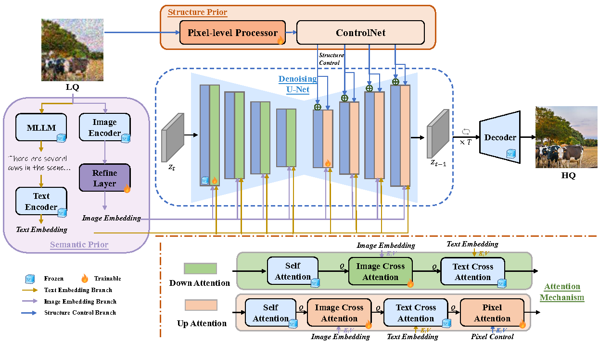

  ## SSP-IR: Semantic and Structure Priors for Diffusion-based Realistic Image Restoration
 
Code repository for our paper "[SSP-IR: Semantic and Structure Priors for Diffusion-based Realistic Image Restoration](https://ieeexplore.ieee.org/document/10870312)" in TCSVT.

The overview of our framework.



## Environment Setup
To set up your environment, follow these steps:
```
conda create -n ENVNAME python=3.8
conda activate ENVNAME
pip install -r requirements.txt
```

## Train

### Step 1
Download the pretrained [SD-V1.5 model](https://huggingface.co/stable-diffusion-v1-5/stable-diffusion-v1-5).

### Step 2

Construct your own training data folder:
The data folder should be like this:
```
your_training_datasets/
    └── gt
        └── 0000001.png # GT images, (512, 512, 3)
        └── ...
    └── sr_bicubic
        └── 0000001.png # LR images, (512, 512, 3)
        └── ...
    └── llm_caption
        └── 0000001.txt # tag prompts
        └── ...
```
You can use the degradation method in [SeeSR](https://github.com/cswry/SeeSR) to generate "sr_bicubic" and use [LLAVA](https://github.com/haotian-liu/LLaVA) to generate "llm caption".


### Step 3
Train the restoration model.
```
bash train.sh
```
Note that:
--pretrained_model_name_or_path is the pretrained SD-V1.5 model path.
--root_folders is your training data folder.
--output_dir is the output path.

## Infernce
After training, you can use the test scripts to test on the testing data.
```
bash test.sh
```
Note that:
--ours_model_path is the checkpoint path of your model.
--image_path can be the test data list or an image path.

## Acknowledgements
Some codes are brought from [SeeSR](https://github.com/cswry/SeeSR), and [SUPIR](https://github.com/Fanghua-Yu/SUPIR). Thanks for their contributions~

If you have any questions, you can contact rainbowow@sjtu.edu.cn.

If you find our code useful, please consider citing us:
```
@ARTICLE{10870312,
  author={Zhang, Yuhong and Zhang, Hengsheng and Cheng, Zhengxue and Xie, Rong and Song, Li and Zhang, Wenjun},
  journal={IEEE Transactions on Circuits and Systems for Video Technology}, 
  title={SSP-IR: Semantic and Structure Priors for Diffusion-based Realistic Image Restoration}, 
  year={2025},
  volume={},
  number={},
  pages={1-1},
  doi={10.1109/TCSVT.2025.3538772}}
```